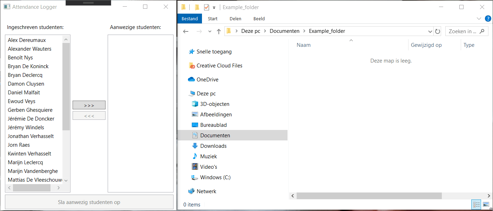

# oe-attendancelogger-start
## Opzet
Deze oefening leest een bestand met de namen van studenten lijn per lijn in.
Vervolgens worden de ingelezen studenten toegevoegd aan een listbox.

Een gebruiker (leraar) kan vervolgens aanduiden welke studenten uit de lijst aanwezig zijn in de les
en een lijst van aanwezige studenten opslaan.

Een bestand wordt uitgelezen en vult `lstSubsribedStudents`. Vervolgens kan de leraar op twee knoppen klikken
om ingeschreven studenten toe te voegen aan of verwijderen uit `lstPresentStudents`.

Bij het klikken op `btnSave` worden de studenten die in `lstPresentStudents` staan weggeschreven naar .txt-bestand op
een locatie die door de gebruiker gekozen kan worden.

## Technische uitwerking
Maak in een aparte class library twee service klasses, `ReadService` en `WriteService`.
**Er wordt een andere aanpak gekozen dan het cursusvoorbeeld.**

### ReadService
Deze klasse is verantwoordelijk voor het uitlezen van een bestand op een **vaste locatie**.
Het bestand dat uitgelezen moet worden vind je in de folder van je solution onder *AttendanceLogger* > *assets* > *students.txt*.
De locatie van dit bestand mag **niet** veranderen! Denk dus goed na over welk (relatief) pad je moet schrijven!

Tip: bestudeer het bestand ook eens. Merk op dat er per lijn een student staat.

Voorzie de klasse van 1 methode: `public List<string> ReadLines(...)` en lees het bovengenoemde bestand lijn per lijn uit.
Dit kan je doen a.d.h.v. deze code:
```
string currentLine;
List<string> lines = new List<string>();

using (StreamReader file = new StreamReader(...))
{
    while((currentLine = file.ReadLine()) != null)
    {
        lines.Add(currentLine);
    }
}
```
In de code hierboven werd bewust een deel weggelaten!

Gebruik de ReadService in de code behind en voeg de namen van de studenten toe aan `lstSubsribedStudents`.
Denk eraan dat sommige studenten accenttekens in hun naam hebben. Zorg ervoor dat de tekst juist ingelezen wordt.

Voorzie bovendien de nodige foutafhandeling.

### WriteService
Ook de `WriteService` heeft slechts 1 methode: `bool WriteToFile(...)`.
Deze schrijft ontvangen data onmiddellijk weg naar een door de gebruiker gekozen locatie en geeft een bool terug.
Indien er succesvol weggeschreven werd, wordt `true` terugggeven. Werd er niet succesvol weggeschreven, dan wordt er met
`false` aangegeven dat er iets fout liep.

Voorzie bovendien de nodige foutafhandeling en voorzie een standaard bestandsnaam.

### Code behind
Voorzie propere code die gebruik maakt van de service klasses.
De gebruiker wordt op de hoogte gesteld van fouten.
Bij belangrijke fouten (bv. het niet kunnen uitlezen van de source file) worden alle knoppen in de applicatie gedisabled.

### Extra's
Sorteer de beide lijsten van studentennamen.

## Voorbeeld



